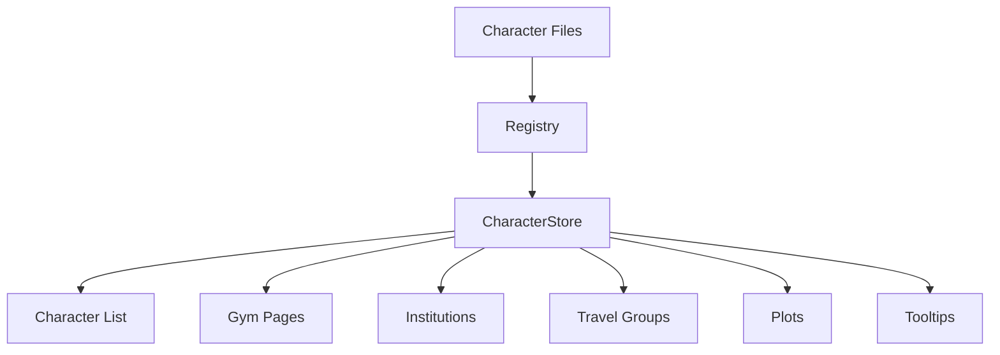

# Current Architecture

## Overview

The application currently operates as a static-content wiki powered by TypeScript data files and Vite's dynamic import system.

Most pages contain hard-coded or static content. Dynamic content primarily exists within the Character System, which serves as the central registry for character information across the site.

---

## Character Content Structure

Characters are organized using a filesystem-driven structure:

```text
data/
└── characters/
    └── [region]/
        └── [category]/
            └── [characterId]/
                ├── index.ts
                ├── pokemon.ts
                ├── achievements.ts
                └── gallery.ts
```

### Region

Represents the character's home region.

Examples:

- kanto
- johto
- oblivia
- alola

### Category

Used to distinguish:

- oc
- npc

### Character ID

Unique identifier used throughout the application.

Example:

```text
esther
reina
ron
```

### Subpages

| File            | Purpose                             |
| --------------- | ----------------------------------- |
| index.ts        | Core Character Metadata             |
| pokemon.ts      | Character Pokémon Team              |
| achievements.ts | Badges, Ribbons, Tournament Results |
| gallery.ts      | Character Artwork and Media         |

---

## NPC Handling

Most NPCs can be represented through external Bulbapedia references.

However, certain NPCs require dedicated local content due to RP-specific modifications.

Examples:

- Gym Leaders
- Elite Four Members
- Champions
- League Officials

These pages may contain:

- Expanded Pokémon Teams
- Additional Battle Formats
- RP-Specific Lore
- Challenge Variants
- Historical RP Events

As a result, NPCs and OCs currently share the same content architecture.

## CharacterStore

The CharacterStore serves as the central content registry for all character data.

### Primary Responsibilities

#### Character Discovery

Provides data for:

- Character Lists
- Character Search
- Region Filters
- Category Filters

#### Character Resolution

Provides lookup functionality using Character IDs.

Example:

```text
characterId → CharacterMeta
```

#### Cross-System Hydration

Many systems store only Character IDs.

The CharacterStore resolves those references into usable character data.

Examples:

- Gym Leaders
- Institution Staff
- Travel Groups
- Plot Participants
- Event Participants

#### Shared Metadata Access

The CharacterStore supplies lightweight character information used throughout the UI.

Examples:

- Character Name
- Portrait
- Region
- Trainer Class
- Summary

This data is commonly displayed through:

- Tooltips
- Hover Cards
- Navigation Links
- Participant Lists


